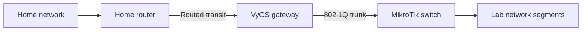

# Lab v2 core network

## Summary

Lab v2 will use VyOS for routing and traffic policy and MikroTik for switching.
This design will define the physical topology, VLANs, addressing, routing,
firewall policy, network services, configuration lifecycle, and failure
behavior. The current draft establishes the design boundary and the decisions
that remain open. It does not assign production addresses or switch ports.

## Context and Scope

Lab v1 contains a working VyOS configuration and network documentation. Those
sources identify useful constraints, but they also combine core networking with
hardware-specific and compute-platform assumptions. Lab v2 will verify the
physical environment and derive a smaller core network before it imports any
configuration.

The legacy sources are evidence, not Lab v2 configuration:

- [VyOS gateway configuration](https://github.com/GilmanLab/lab/blob/master/infrastructure/network/vyos/configs/gateway.conf)
- [Network description](https://github.com/GilmanLab/lab/blob/master/docs/architecture/08_concepts/networking.md)

[ADR-0001](../../decisions/0001-use-vyos-for-layer-3-and-mikrotik-for-layer-2.md)
assigns Layer 3 routing and policy to VyOS and Layer 2 switching to MikroTik.

## Goals

- Verify each managed network device, interface, link, and supported link speed.
- Define the physical topology and the responsibility of each device.
- Define VLANs, subnets, gateway addresses, and allocation rules.
- Define routes between the home network, lab networks, and the internet.
- Define NAT behavior and source-address preservation.
- Define a default traffic policy and each permitted flow between network
  segments.
- Assign DHCP, DNS, and time-service responsibilities.
- Define management access and recovery access.
- Store VyOS and MikroTik configuration in version control.
- Define validation, deployment, rollback, and drift-detection behavior.
- State the effect of a gateway, switch, link, or upstream-router failure.

## Non-goals

- Compute-platform network configuration
- Workload network overlays
- Application ingress or service advertisement
- Application DNS records
- Service-to-service traffic policy
- Storage protocol design

These systems may use the core network after its interfaces and policies are
stable.

## Design Overview

The initial logical boundary is:

The diagram does not assign interfaces, addresses, VLAN IDs, or link speeds.
The design will assign those values after physical verification.

VyOS routes traffic between lab segments and applies firewall policy. VyOS also
controls lab egress and NAT. MikroTik carries VLANs between VyOS and connected
devices. The design will specify whether any segment remains Layer 2-only.

## Detailed Design

### Physical Topology

The physical topology will identify:

- Device manufacturer, model, and operating system
- Interface name, media, supported speed, and MAC address
- Cable endpoints and negotiated speed
- Access, trunk, aggregation, and management links
- Out-of-band access that remains available after a configuration failure

The first implementation step is an on-device inventory. The design must not
reuse the Lab v1 interface mapping until the inventory confirms it.

### Device Responsibilities

| Device | Assigned responsibility | Not assigned by this design |
| --- | --- | --- |
| VyOS gateway | Routed gateways, route selection, firewall policy, NAT | Final DHCP, DNS, and time-service ownership |
| MikroTik switch | VLAN transport, access ports, trunks, physical link aggregation | Routing between lab segments |
| Home router | Home-network routing and the upstream side of the lab transit | Lab inter-segment policy |

The home-router role comes from the Lab v1 topology. Lab v2 must confirm the
specific device and transit behavior.

### VLANs and Addressing

The accepted design will define each segment in one table with these fields:

- VLAN ID and name
- Purpose and trust level
- IPv4 subnet and, if used, IPv6 prefix
- Gateway owner and address
- Allocation method
- DHCP range and reservation range
- DNS behavior
- Routed or Layer 2-only status
- Maximum transmission unit

Lab v1 used `10.10.0.0/16` for lab networks and divided it into `/24` subnets.
That allocation is a candidate input, not an accepted Lab v2 address plan.

The design will avoid workload-specific segment names. Segment names will
state their network function or trust boundary.

### Routing and NAT

The accepted design will specify:

- The home-to-lab transit network and both endpoints
- The route that the home router uses for lab prefixes
- The default route that VyOS uses for internet access
- Which prefixes VyOS advertises or configures statically
- Where source NAT applies
- Which flows retain their original source address
- Route preference and failure behavior

Lab v1 used a routed `/30` transit between the home router and VyOS. It also
applied source NAT to lab egress. Lab v2 must confirm whether that model remains
necessary and whether it causes more than one layer of NAT.

### Traffic and Firewall Policy

The design will express policy as a directional traffic matrix. Each rule will
identify:

- Source segment
- Destination segment or external network
- Protocol and destination port
- Connection direction
- Required source-address behavior
- Reason and owning service

The design must define default behavior for:

- Home network to lab
- Lab to home network
- Lab to internet
- Traffic between lab segments
- Traffic addressed to VyOS
- Management access to network devices

Stateful reply traffic is not a separate initiated flow. The implementation
will distinguish established replies from new connections.

### DHCP, DNS, and Time

The design will assign one owner for each service on each segment.

For DHCP, it will define the server or relay, allocation range, reservations,
lease behavior, and failure behavior. For DNS, it will define upstream
resolvers, local authoritative zones, forwarding behavior, and the domain used
for lab names. For time synchronization, it will define the upstream source and
whether network devices serve downstream clients.

No Lab v1 DHCP range, resolver, or local domain becomes a Lab v2 value without
review.

### Management and Recovery Access

The design will define:

- The network path used for routine administration
- The source networks permitted to manage each device
- Authentication and secret storage
- Access available when the primary trunk or gateway configuration fails
- Console or physical recovery requirements

Management access must not depend only on the configuration being repaired.

### Configuration Lifecycle

VyOS and MikroTik will each have one version-controlled configuration source.
The delivery design will define:

1. How a change is rendered or generated
2. How automation validates syntax and policy before deployment
3. How an operator reviews the effective change
4. How automation applies the change
5. How automation verifies connectivity before saving it
6. How an operator rolls back a failed change
7. How automation detects drift from the repository state

The selected tools and configuration formats remain open.

### Failure Behavior

The accepted design will state the observed effect and recovery path for:

- VyOS failure
- MikroTik failure
- Loss of the VyOS-to-MikroTik trunk
- Loss of the home transit
- Loss of one member of an aggregated link
- DHCP or DNS failure
- Invalid or partially applied configuration

The current hardware appears to provide one gateway and one switch. The design
must either accept those single points of failure or add redundancy with a
specific recovery model.

## Delivery

### Migration and Rollout

Lab v2 will not modify the current network until the design identifies the
physical links, management path, rollback method, and expected validation
results. The implementation sequence will be developed after those facts are
known.

### Rollback and Recovery

The implementation must preserve a tested path to the previous device
configuration. The design must state whether rollback uses a timed commit,
startup configuration, console access, configuration backup, or another
verified mechanism for each device.

### Validation

Acceptance evidence must cover the changed behavior, not only configuration
presence. At minimum, validation will observe:

- Negotiated interface state and speed
- VLAN membership and isolation
- Gateway reachability from each routed segment
- Expected routes on VyOS and the home router
- Permitted and denied flows from the traffic matrix
- Source addresses before and after NAT
- DHCP lease allocation where DHCP is enabled
- Forward and reverse DNS behavior where DNS is enabled
- Management access from permitted and denied sources
- Rollback after a deliberately rejected or failed change

## Alternatives Considered

### Import the Lab v1 configuration unchanged

- Advantage: Existing files provide a detailed starting point.
- Disadvantage: They include assumptions outside the Lab v2 core-network scope.
- Disadvantage: Interface mappings, switch hardware, and physical cabling have
  not been verified for Lab v2.
- Outcome: Use the files as evidence, not as the Lab v2 source of truth.

### Route lab segments on MikroTik

- Advantage: Routed traffic can remain on the switch.
- Disadvantage: Routing and policy ownership would be split between MikroTik
  and VyOS.
- Outcome: Rejected by ADR-0001.

### Use one flat Layer 2 lab network

- Advantage: Fewer gateways and traffic policies are required.
- Disadvantage: Network functions cannot have routed security boundaries.
- Disadvantage: Broadcasts and Layer 2 failures affect every connected system.
- Outcome: Rejected by ADR-0001.

## Open Questions

1. What are the exact models, interface names, port capabilities, and current
   cable endpoints?
2. Which device and interfaces terminate the home-to-lab transit?
3. Which network functions require separate trust boundaries?
4. Which VLAN IDs, IPv4 subnets, and IPv6 prefixes will Lab v2 use?
5. Does any segment need to remain Layer 2-only?
6. What MTU applies to access ports, trunks, routed links, and aggregated links?
7. Which device or service owns DHCP, DNS, and time synchronization?
8. What is the default inter-segment firewall policy?
9. Is one VyOS gateway and one MikroTik switch an accepted failure model?
10. Which tools will render, validate, deploy, roll back, and audit each device
    configuration?
